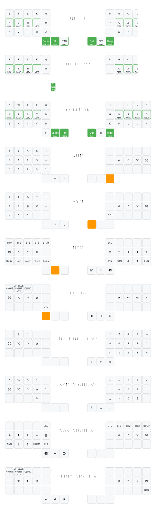

# Keyboard Configuration

Custom keyboard firmware for split ergonomic keyboards using a unified keymap code generation system.

## Keymap Visualizations

### 3x5_3 Layout (36-key boards)

### 3x6_3 Layout (42-key boards)

## About

This repository uses a unified YAML configuration to generate keymaps for both QMK and ZMK firmware. All keymaps are defined in `config/keymap.yaml` and automatically generated for each keyboard.

See [CLAUDE.md](CLAUDE.md) for detailed documentation.
