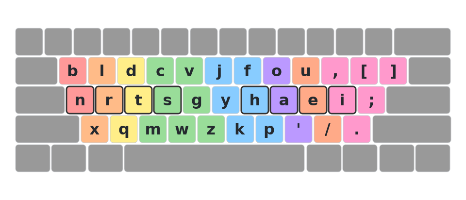
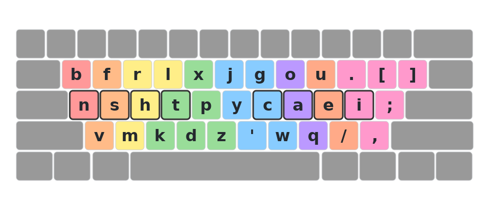

[](https://github.com/daranguiz/qmk_userspace/actions/workflows/build-all.yml)

# Keyboard Configuration

Custom keyboard firmware for split ergonomic keyboards using a unified keymap code generation system.

## Supported Keyboards

| Board | Firmware | Layout |
|-------|----------|--------|
| Bastard Keyboards Skeletyl | QMK | 3x5+3 (36 keys) |
| Boardsource Lulu | QMK | 3x6+3 (42 keys) |
| Lily58 | QMK | 3x6+3 (42 keys) |
| Chocofi | ZMK | 3x6+3 (42 keys) |
| Corneish-Zen | ZMK | 3x6+3 (42 keys) |
| GEIGEIGEIST TOTEM | ZMK | 3x5+1+3 (38 keys) |
| Jels Boaty | QMK | Custom (63 keys) |
| Ripple (Cosmos Dactyl) | QMK | 3x5+3 (36 keys) |

## Combos

### Bootloader Entry (DFU)
- Left hand: `B` + `Q` + `Z`
- Right hand: `P` + `.` + `'`

### GitHub URL
- Keys: `G` + `O` + `U` + `.`
- Outputs: `https://github.com/daranguiz/keyboard-config?tab=readme-ov-file#readme`

## Keymap Visualizations

Magic key mappings are included at the bottom of each layout visualization.

### Split Ergonomic Keyboards


### Row-Staggered Keyboards (macOS .keylayout)

#### Gallium


#### Nightlight


#### Nightlight-LHM


#### Rain


#### Rainy Racket


#### Sturdy


## Testing

The project includes a comprehensive tiered testing suite with 228 tests:

### Test Runner Script

```bash
./run-tests.sh            # Run Tier 1 tests (fast, < 2 min)
./run-tests.sh --tier2    # Run Tier 2 E2E tests (15-30 min)
./run-tests.sh --all --coverage --cov-html  # All tests with coverage
./run-tests.sh --help     # See all options
```

### Quick Regression Tests (Tier 1)
```bash
./run-tests.sh            # Recommended
# or
pytest                    # Direct pytest
```

**196 tests** including unit tests and integration tests (without firmware compilation) to catch regressions quickly.

### Comprehensive Tests (Tier 2)
```bash
./run-tests.sh --tier2    # Recommended
# or
pytest --tier2            # Direct pytest
```

**32 tests** that compile actual QMK and ZMK firmware for all boards to ensure generated code builds successfully.

Requires:
- QMK firmware repo (`QMK_FIRMWARE_PATH`)
- ZMK firmware repo (`ZMK_REPO`)
- Docker (for ZMK builds)

### Coverage Report
```bash
./run-tests.sh --coverage --cov-html  # Recommended (auto-opens browser)
# or
pytest --cov=scripts --cov-report=html
open htmlcov/index.html
```

### Environment Check
```bash
./run-tests.sh --check-env  # Verify Tier 2 test requirements
```

See [tests/README.md](tests/README.md) for detailed testing documentation.

## About

This repository uses a unified YAML configuration to generate keymaps for both QMK and ZMK firmware. All keymaps are defined in `config/keymap.yaml` and automatically generated for each keyboard.

See [CLAUDE.md](CLAUDE.md) for detailed documentation.
