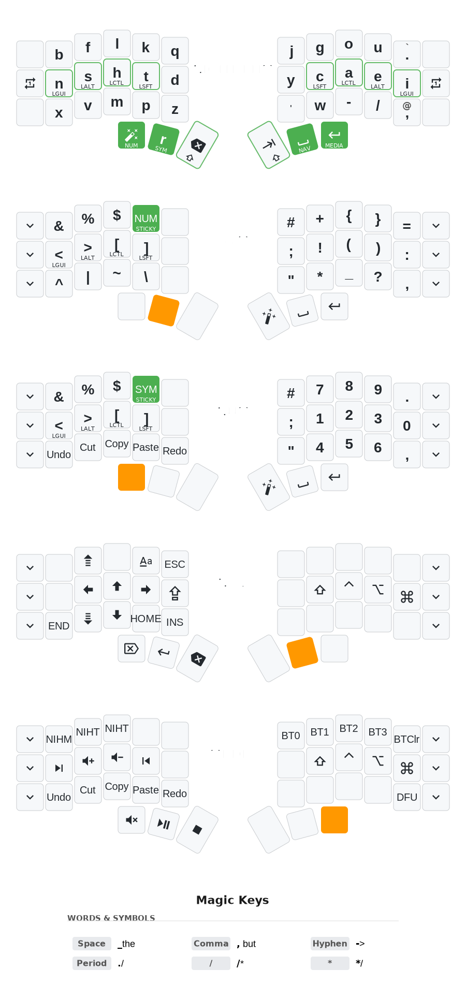
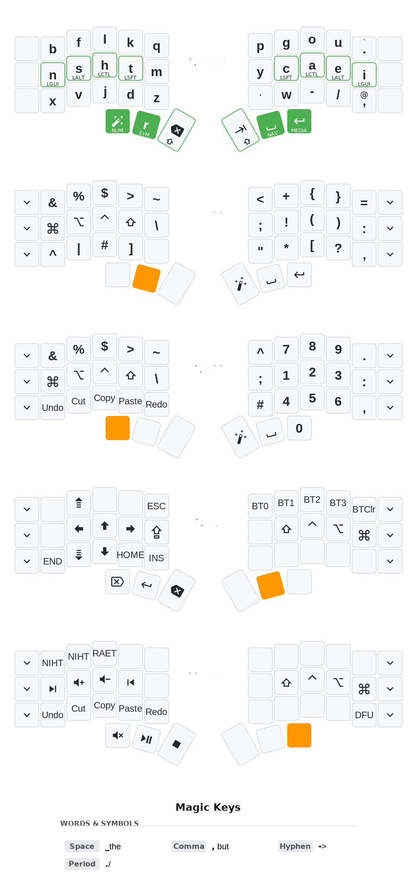
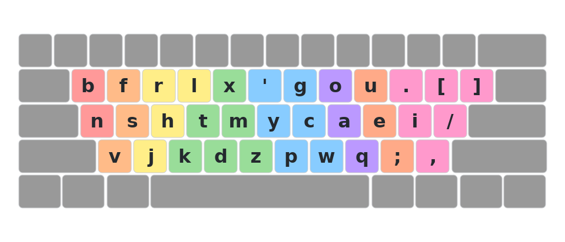
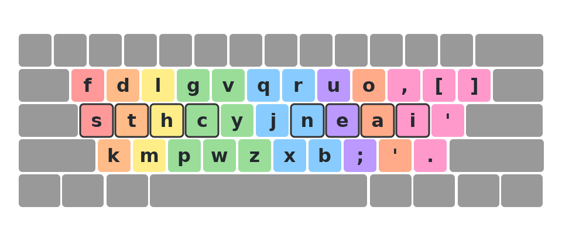
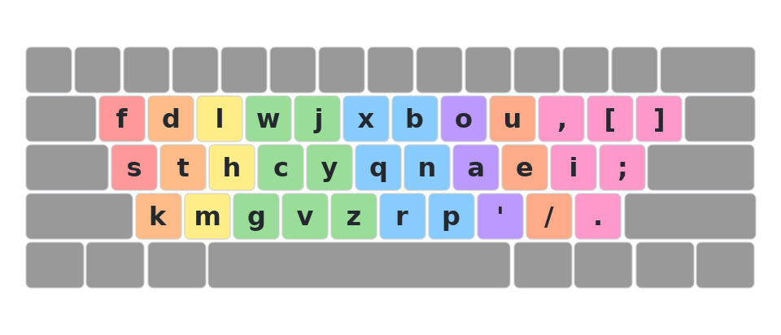
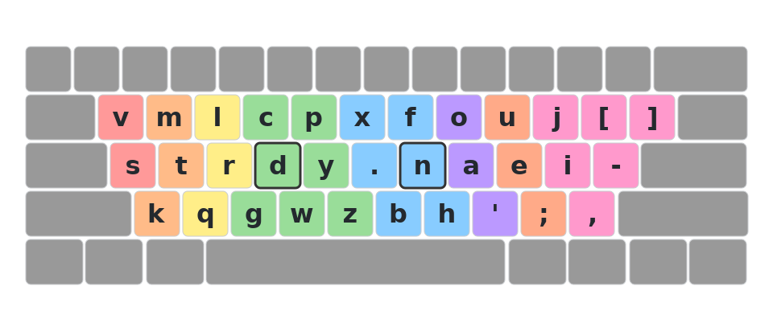

# Keyboard Configuration

Custom keyboard firmware for split ergonomic keyboards using a unified keymap code generation system.

## Combos

### Bootloader Entry (DFU)
- Left hand: `B` + `Q` + `Z`
- Right hand: `P` + `.` + `'`

### GitHub URL
- Keys: `G` + `O` + `U` + `.`
- Outputs: `https://github.com/daranguiz/keyboard-config?tab=readme-ov-file#readme`

## Magic Keys

Training is on: typing a mapped bigram directly emits `#`; disable with `python3.11 scripts/generate.py --no-magic-training`.

PRIMARY (default: repeat):

| First key | Magic output |
| --------- | ------------ |
| (space)   |  THE         |
| ,         | , BUT        |
| -         | ->           |
| .         | ./           |
| A         | AO           |
| B         | BEFORE       |
| C         | CY           |
| D         | --           |
| E         | --           |
| F         | --           |
| G         | GY           |
| H         | HL           |
| I         | ION          |
| J         | JUST         |
| K         | --           |
| L         | --           |
| M         | MENT         |
| N         | NION         |
| O         | OA           |
| P         | PY           |
| Q         | QUE          |
| R         | --           |
| S         | --           |
| T         | TION         |
| U         | UE           |
| V         | VS           |
| W         | WHICH        |
| X         | --           |
| Y         | Y'           |
| Z         | --           |

ALT (default: repeat):

| First key | Magic output |
| --------- | ------------ |
| .         | ./           |
| A         | AY           |
| B         | BR           |
| C         | CS           |
| D         | --           |
| E         | EY           |
| F         | --           |
| G         | GS           |
| H         | --           |
| I         | --           |
| J         | --           |
| K         | --           |
| L         | --           |
| M         | MB           |
| N         | --           |
| O         | OK           |
| P         | PH           |
| Q         | --           |
| R         | RL           |
| S         | SC           |
| T         | --           |
| U         | UE           |
| V         | --           |
| W         | --           |
| X         | --           |
| Y         | YE           |
| Z         | --           |

## Keymap Visualizations

### Split Ergonomic Keyboards

#### PRIMARY Layout

#### ALT Layout

### Row-Staggered Keyboards (macOS .keylayout)

#### Nightlight

#### Rain

#### Rainy Racket

#### Sturdy

## About

This repository uses a unified YAML configuration to generate keymaps for both QMK and ZMK firmware. All keymaps are defined in `config/keymap.yaml` and automatically generated for each keyboard.

See [CLAUDE.md](CLAUDE.md) for detailed documentation.
